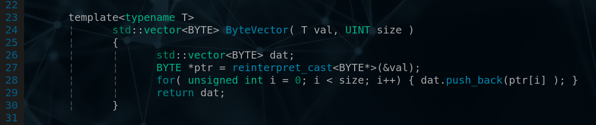

# auroslib help file 

###### 1. ADB 
###### 2. NET 
###### 3. ModbusTCP 
###### 4. APiD 
###### 5. C++  

--- 
--- 
---

# 1. AUROS Database

###### AUROS Database Server & AUROS Database Console

- AUROS Database (ADB): Fast, Hybrid, Key-Value, NoSQL

- AUROS Database Server (ADBS): multithreding program using APiD (AUROS Package in Datagrams) Communication. 

- AUROS Database Server Console (ADBSC): simple diagnostic interface. 


---

#### ADBS Frame.


```C
Header:                 "adbs" 
Function marker:        "_#:" 
String value marker:    "%" 
EOF function:           "&" 
```


- Structure: 


```C
"adbs" + "_#:" + [function number] 
```


- Function number: 

> one byte, or after '%' three bytes string. (1-255) 


```C
 "_#:"[0x01] == "_#:%001"
``` 

- Minimal Frame: 


``` 
"adbs_#:&" 
``` 
 
<BR>

Server answer:  
```C
SEQ_OK
``` 
<BR>

---

#### ADBS/C Command list: 


 | Code | ADBS Command | Server Answer | 
 |------|--------------|---------------| 
 | 0x01 | DBLIST ;                  | DBLIST: [list of DB's] |
 | 0x02 | PSWD [PSWD] ;             | PSWD_OK, WRONG_PSWD |
 | 0x03 | MKDB [NAME] ;             | PSWD_REQ, MKDB_OK, MKDB_ERROR, PSWD_REQ |
 | 0x04 | RMDB [NAME] ;             | PSWD_REQ, RMDB_OK |
 | 0x05 | INITDB [NAME] ;           | PSWD_REQ, INITDB_OK, INITDB_ERROR|
 | 0x06 | ADDR [KEY] [DATA] ;       | PSWD_REQ, INITDB_REQ, ADDR_OK, ADDR_ERROR |
 | 0x07 | WRITEDB ;                 | PSWD_REQ, WRITEDB_OK, WRITEDB_ERROR |
 | 0x08 | GETDID [ID] ;             | PSWD_REQ, INITDB_REQ, GETDID_OK. GETDID_ERROR |
 | 0x09 | GETDRC [R] [C] ;          | PSWD_REQ, INITDB_REQ, GETDRC_OK. GETDRC_ERROR|
 | 0x0A | GETDSTR [STR] ;           | PSWD_REQ, INITDB_REQ, GETDSTR_OK. GETDSTR_ERROR|
 | 0x0B | EDITDID [ID] [DATA] ;     | PSWD_REQ, INITDB_REQ, EDITDID_OK. EDITDID_ERROR|
 | 0x0C | EDITDRC [R] [C] [DATA] ;  | PSWD_REQ, INITDB_REQ, EDITDRC_OK. EDITDRC_ERROR |
 | 0x0D | EDITDSTR [STR] [DATA] ;   | PSWD_REQ, INITDB_REQ, EDITDSTR_OK. EDITDSTR_ERROR|
 | 0x0E | GETRKS ;                  | RAM_KEY SIZE: [ Ram_Key_Size ] |
 | 0x0F | RANGE [ID] [RANGE] [OPT]; | PSWD_REQ, INITDB_REQ, RANGE_OK. RANGE_ERROR |


```
[PSWD]          - Password (string) 
[NAME]          - DB Name (string) 
[DATA]          - Data... 
[KEY]           - [R](UINT 4B) + [C](UINT 4B) + [STR](CHAR 32B) 
[ID]            - [ID](UINT 8B) 
[Ram_Key_Size]  - Ram Key Size (UINT 8B) 
[RANGE]         - Range (if Range and ID = 0 return all records) 
[OPT]           - Options (BYTE)
                  if( OPT == 0 ) separator = ""
                  if( OPT == 1 ) separator = " " 
                  if( OPT == 2 ) separator = ", "
                  if( OPT == 3 ) separator = "DATA:"
                  if( OPT == 4 ) separator = "DATA[n]:"
```


#### Sample command(console - ADBSC): 
```
pswd password initdb tstdb addr 1 2 VAL_1 data!@#$%^& writedb ;
```

#### Sample frame: 
 PSWD + INITDB + ADDR + WRITEDB 


```
adbs_#:%002password[0x00]_#:%005tstdb[0x00]_#:[0x06][0x00000001][0x00000002]VAL_1[0x00][data!@#$%^&]_#:%007_#:& 
```


#### ADB Functions list: 
```C++
[C++]
unsigned int auros::LoadDataFromFileToDb( string file, string db, unsigned int type ) 
// file = "list.csv", db = "datain"
// type: 0 - bytes, 1 - real

double auros::GetDoubleFromDbById( string dbb, unsigned long int id ) 
double auros::GetDoubleFromDbByName( std::string dbb, std::string name) 

bool auros::InitDB(const string &db)
unsigned int auros::GetRamKeySize()
bool auros::MkDbFile(const string &name)
bool auros::WriteDB()
bool auros::LoadNewRamKey(const ramkey &rmk)
unsigne int auros::GetStatus(UDINT id)
bool auros::Data( key &key, const RW_type &keytype, vector<BYTE> &data)
// keytype: 0 = ID, 1 = R/C, 2 = String   //  0x10 -> bit 4 = WRITE

// ADBS FRAME class
// for ADBS Frame assembly 
adbsframe()
void Header()
void EoF()
std::vector<BYTE> GetFrame()
void DbList()
void Pswd(std::string pswd)
void MkDB(std::string dbname)
void RmDB(std::string dbname) 
void InitDB(std::string dbname) 
void AddR(UINT r, UINT c, std::string key, std::vector<BYTE> data) 
void WriteDB() 
void GetDID(unsigned long id) 
void GetDRC(UINT r, UINT c) 
void GetDStr(std::string str) 
void EditDID(unsigned long id, std::vector<BYTE> data) 
void EditDRC(UINT r, UINT c, std::vector<BYTE> data) 
void EditDStr(std::string str, std::vector<BYTE> data) 
void GetRKS() 
void Range(unsigned long id, unsigned long rng) 

// Example: 
//
// adbsframe FRAME; 
// FRAME.Header(); 
// FRAME.DbList(); 
// FRAME.Pswd("password"); 
// FRAME.MkDbFile("newdb");
// FRAME.EoF(); 
// 
// FRAME.GetFrame() // redy to send via APiD  


```

```
LoadDataFromFileToDb CSV file format: 
----------------------
| DATA | KEY | R | C | 
|------|-----|---|---|

Example:
----------------------
| 1234 | v1  | 0 | 0 |
|------|-----|---|---|
| 2213 | v2  | 0 | 1 |
|------|-----|---|---|
| 3215 | v3  | 0 | 2 |
|------|-----|---|---|
etc... 
```


<BR> <BR> 

---

# 2. Network Library 

###### C++ Wrapper Library for UDP and TCP .  

files:
```
tcpserver.hpp
tcpclient.hpp
udpserver.hpp
udpclient.hpp
```

included in **auroslib.hpp**<BR>

Sample pseudo code: <BR>

```C
#include "auroslib.hpp"

std::vector<BYTE> msg;

using namespace auros; 

ReadConfig("config");           // bool, configfile required 
// After ReadConfig can use VAR:: variables 
// bool, no Errors = 0

auros_tcp_serv tcpserwer(VAR::TCP_SERV_PORT, VAR::TCP_SERV_IP , VAR::TCP_SERV_BUFF);

tcpserwer.Bind();              // bool
tcpserwer.Accept();            // bool
tcpserwer.Recv(msg);           // bool
tcpserwer.Send(msg);           // bool

//----------------------------------------------------

#include "tcpclient.hpp"

auros_tcp_cli tcpclient(VAR::TCP_SERV_PORT, VAR::TCP_SERV_IP, VAR::TCP_CLI_BUFF);

tcpclient.Connect();           // bool
tcpclient.Send(msg);           // bool
tcpclient.Recv(msg);           // bool

//----------------------------------------------------

#include "udpserver.hpp"

auros_udp_serv udpserwer(VAR::UDP_SERV_PORT, VAR::UDP_SERV_IP, VAR::UDP_SERV_BUFF);

udpserwer.Recv(msg);
udpserwer.Send(msg);
udpserver.Send(msg, CliPort); 

//----------------------------------------------------

#include "udpclient.hpp"

auros_udp_cli udpclient(VAR::UDP_SERV_PORT, VAR::UDP_SERV_IP, VAR::UDP_CLI_BUFF);

udpclient.Send(msg);
udpclient.Recv(msg);

```
 

<BR> <BR> 
 
#### Config file. 

- **First line must be: `#AUROSNET CONFIG FILE.`!** 
- **No white space in The end of lines!** 

```bash
#AUROSNET CONFIG FILE.

#TCP_SERV_IP:
127.0.0.1

#TCP_SERV_PORT:
55000

#TCP_SERV_BUFF:
2048

#UDP_SERV_IP:
127.0.0.1

#UDP_SERV_PORT:
8888

#UDP_SERV_BUFF:
2048

#TCP_CLI_IP:
127.0.0.1

#TCP_CLI_PORT:
55000

#TCP_CLI_BUFF:
2048

#UDP_CLI_IP:
127.0.0.1

#UDP_CLI_PORT:
8889

#UDP_CLI_BUFF:
20148
``` 


<BR> <BR> 

---

# 3. Modbus TCP 

###### C++ Library for ModbusTCP.  

files:
```
modbus.hpp
modbus.cpp
```

included in **auroslib.hpp**

Function list: 

```C
modbus(std::string ip, unsigned int prt);
std::vector<BYTE> GetFrame();
unsigned int GetFrameLenth();
void SetFrame( unsigned int slave_id, unsigned int fun );
void AddData( int val );
bool Connect();
bool TxRx();
std::vector<BYTE> Recv();
std::vector<BYTE> GetData();
int GetDataLenth();

// -----------------------------------------------

// modbustcp wrapper class
modbustcp(std::string ip, UINT port);
std::vector<REAL> GetReal(UINT id, UINT addr, UINT count); 
std::vector<UINT> GetInt(UINT id, UINT addr, UINT count); 
```

Sample pseudo code: <BR>

```C
auros::modbus ModBus( "192.168.1.55", 502 ); 

ModBus.Connect();

ModBus.AddData( 1002 );
ModBus.AddData( 8 );
ModBus.SetFrame( 1, 3 ); /// slave ID, Fun

ModBus.TxRx();
vector<BYTE> data = ModBus.GetData(); 

for( unsigned int i = 0; i < data.size(); i+=4)
{
       cout << auros::Realer( data, i, 0) << ", " ;  
}

// -----------------------------------------------

// modbustcp - wrapper
modbustcp MdbTcp( IP, port);
vector<float> val = MdbTcp.GetReal( 1, 1008, 2 );
```

modbustcp wrapper is simple version of library for function = [0x03]. 


<BR> <BR> 

---

# 4. Package in Datagrams 


###### Simple and Powerfull comunication protocol based on UDP. 

- UDP based. 
- Simple and fast. 
- Datagrams receve confirmation. 
- Datagrams flow control. 
- Send and Receve buffers. 
- Timeout configuration. 
- Lost Datagrams counter. 


 <p style="text-align: center;">Package disassemble to datagrams --> sent to The target --> datagrams reassembled</p>

<BR> <BR> 

#### C++ Library 

files:
```
apid.hpp
apid.cpp
```

included in **auroslib.hpp**
 

Function list: 

```C

apid( string myip, string targetip, UINT myport, UINT targetport ); 
bool SendPKG(vector<BYTE> pkg); 
bool GetPKG(vector<BYTE> &pkg); 
UINT GetBuffSize(); 
void Report(); 
UINT GetError(); 
string GetMyIP(); 
UINT GetMyPORT(); 
string GetTargetIP(); 
UINT GetTargetPORT(); 

```

apid constructor requires special config file
 
<BR> <BR> 
 
#### Config file. 

- Filename: `apidconfig`
- **First line must be: `#AUROS PiD Config File`!** 
- **No white space in The end of lines!** 

```bash
#AUROS PiD Config File

#MyIp
127.0.0.1 
 
#MyPort
55000 
 
#TargetIp
192.168.0.1 
 
#TargetPort
55001 
 
#SendErrCount
4 
 
#TimeOut
250 

#TimeOutIdle
0
 
#Debug
0 
``` 

> #### TimeOutIdle [cycles] 
> 
> If not set or set less than SendErrCount is NOT active. 
> 
> If You want to calculate value in miliseconds: [ms] = TimeOut x TimeOutIdle 

> #### Debug [0-9]
> 
> If set to 0 no extra information.  


```
SEND --> DTG[1].1 
no answer for 250ms 
SEND --> DTG[1].2 
no answer for 250ms 
SEND --> DTG[1].3 
    <-- If answer here - normal communication. 
no answer for 250ms 
SEND --> DTG[1].4 
    <-- If answer here - normal communication. 
no answer for 250ms 
>>> ERROR 8 (bit 3)

       Total time for Error 4x250ms = 1s 
```

<BR> <BR> 

#### Errors.

For user program, Errors are returned from library Function; 

```C
 
unsigned int Error(); 
 
``` 

- **bit 0** - Wrong Header: APiD Config File - LoadConfig()
- **bit 1** - Wrong parameter counter - LoadConfig()
- **bit 2** - Server Binding Error 
- **bit 3** - SendErrLimit Reached. Stop()!
- **bit 4** - TimeOutIdle - No Comunication. Stop()! 
- **bit 5** - 
- **bit 6** - 
- **bit 7** - 

Additionaly `cerr` and `stdout` streams may be redirected to a file from shell script. 

```bash
 
#!/bin/sh 
datax=$(date +'%m_%d_%Y_%H_%M_%S') 
./ADBS > log/ADBS_LOG_$datax 2>&1 
#./ADBS 2> log/ADBS_LOG_$datax # only cerr 

```


<BR> <BR> 

#### Header.


 - PKG - Package 
 - DTG - Datagram 
 - PKG_S - Package size 
 - R_PKG - Package confirmation 
 - R_DTG - Datagram confirmation 


<BR> <BR> 

#### Flow.

Sending first Package in size of one datagram. 

 | PKG  | DTG  | R_PKG | R_DTG | PKG_S | DATA |
 |------|------|-------|-------|-------|------|
 | 0x01 | 0x01 | 0x00  | 0x00  | 0x01  | ...  | 
 


 Reply

 | PKG  | DTG  | R_PKG | R_DTG | PKG_S | 
 |------|------|-------|-------|-------|
 | 0x00 | 0x00 | 0x01  | 0x01  | 0x00  | 
 

 --- 


 Sending second datagram form Package no 5 in size of 3 datagrams. 

 | PKG  | DTG  | R_PKG | R_DTG | PKG_S | DATA |
 |------|------|-------|-------|-------|------|
 | 0x05 | 0x02 | 0x00  | 0x00  | 0x03  | ...  | 
 


 Reply

 | PKG  | DTG  | R_PKG | R_DTG | PKG_S | 
 |------|------|-------|-------|-------|
 | 0x00 | 0x00 | 0x05  | 0x02  | 0x00  | 
 


 Reply in another package 

 | PKG  | DTG  | R_PKG | R_DTG | PKG_S | DATA |
 |------|------|-------|-------|-------|------|
 | 0x08 | 0x03 | 0x05  | 0x02  | 0x06  | ...  | 
 


 --- 


<BR> <BR> 

#### APiD for ADBS. 

Init (UDP) <BR>
Sending open message to port 54000.

```
"open " + MY_PORT[UINT, 4B] 
```

Sample answer from ADB Server: 

```
APiD Connection Created @ 192.168.1.201 : 55005
```

After this sequence regular APiD communication works from MY_PORT to 55005. 


```C++
[C++]
unsigned int auros::AdbsInit(std::string adbsip, UINT adbsport); 
```

Is imprtant to close connection after work. 
Simply send "close" string to ADBS. 

```
"close " 
```


# 5. C++ 



###### Other standard auroslib functions. 

```C++

// Types 
typedef long int                DINT 
typedef unsigned long int       UDINT 
typedef int                     INT
typedef unsigned int            UINT 
typedef unsigned char           BYTE 


void auros::Msg(string id, string msg)                  // cout 
void auros::Err(string id, string err)                  // cerr 


// Timer 
auros::T::T(unsigned int ST)
bool auros::T::Run()
void auros::T::Set(unsigned int ST)
void auros::T::Reset()
bool auros::T::Output()
unsigned int auros::T::ET()

// RE 
auros::RE::RE()
bool auros::RE::Run(bool in)

// FE 
auros::FE::FE()
bool auros::FE::Run(bool in)

// RFE 
bool auros::RFE::Run( bool in )

// RFE_SW 
void auros::RFE_SW::Run(bool i_sw, bool &o_sw )

// IMP_SW 
auros::IMP_SW::IMP_SW(unsigned int tf )
void auros::IMP_SW::Run( bool i_sw, bool &o_sw, unsigned int swon, unsigned int swoff )
bool auros::IMP_SW::Active()
void auros::IMP_SW::Reset()
unsigned int auros::IMP_SW::Clicks()

// Get actual time 
string auros::ActTime()

// float from BYTE vector [4B]
float auros::Realer(  std::vector<BYTE> dat, UINT pos, bool revers )

// INT from BYTE vector [4B]
int auros::Inter( std::vector<BYTE> dat, UINT pos, bool revers )

// double from BYTE vector [8B]
double auros::Realerd(  std::vector<BYTE> dat, UINT pos, bool revers )

// Get vector of bytes 
std::vector<BYTE> ByteVector( T val, UINT size ) 

// bit, byte, word operations 
T SetBit(T &byte, unsigned int c)
T ResetBit(T &byte, unsigned int c)
bool GetBit(T byte, unsigned int c)
unsigned char GetByte(T val, unsigned int c)
T SetByte(T &val, unsigned char byte, unsigned int c)
T SetWord(T &val, unsigned short int word, unsigned int c)
T SetWord(T &val, unsigned short int word, unsigned int c)
T GetWord(T val, unsigned int c)

// example: 
//      Dword           = 0x00000000 
//      NewDWord        = 0x00000000 
//
//      NewDWord = SetByte( Dword, 0xCA, 3 )
//      NewDWord        = 0xCA000000 
//      Dword           = 0xCA000000 
//       
//      NewDWord = SetByte( Dword, 0xFE, 2 )
//      NewDWord        = 0xCAFE0000 
//      Dword           = 0xCAFE0000 
//       
//      NewDWord = SetByte( Dword, 0xBA, 1 )
//      NewDWord        = 0xCAFEBA00 
//      Dword           = 0xCAFEBA00 
//       
//      NewDWord = SetByte( Dword, 0xBE, 0 )
//      NewDWord        = 0xCAFEBABE 
//      Dword           = 0xCAFEBABE 
//       

// Read Data (double) from text file 
// data separated with space or tab 
readdata(string filename)
double Get( int i ) 
double Get() 
bool EoF() 
unsigned int GetDatasize() 
void ResetPointer() 

// example: 
readdata SampleData("data.txt") 
for( UINT i = 0; i < SampleData.GetDatasize(); i++)
{
        cout << SampleData.Get(i) << endl; 
}

// or 

SampleData.ResetPointer(); 
for( ; ; )
{
        cout << SampleData.Get() << endl;
        if( SampleData.EoF() ){ break; }
}


// Pomiar nano seconds 
auros::pomiar_ns POMIAR; 
POMIAR.Start(); 
// do your work... 
POMIAR.Stop(); 
POMIAR.Wyniki();  // cout....


```


